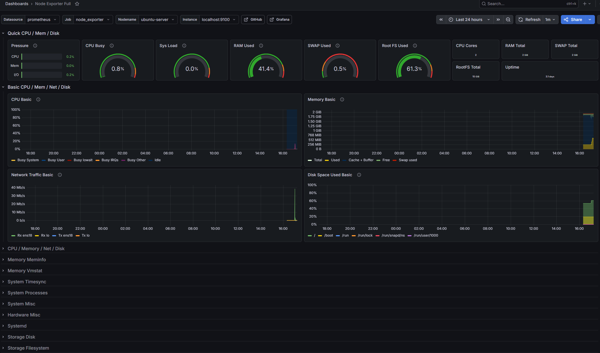

# Drake's Homelab

A personal homelab built to develop real-world IT infrastructure skills.

## About This Project

Built this homelab to develop real-world IT infrastructure skills 
in Linux administration, Windows Server, and network security. 
The isolated environment allows hands-on experimentation — breaking 
and rebuilding things freely to understand why failures occur and 
how to resolve them. Goal is to bring practical experience directly 
applicable to enterprise IT environments.

## Hardware
- Acer Predator PH16-71 (Proxmox host)
  - 16GB RAM
  - RTX 4060
- Managed Switch
- PDU
- Console Cable

## Network
- ISP: Cincinnati Bell Fioptics
- Router: Eero
- Proxmox Host IP: 192.168.4.50

## Stack
| Service | Purpose | Status |
|---|---|---|
| Proxmox VE 8.x | Hypervisor | ✅ Running |
| pfSense | Virtual Firewall/Router | ✅ Running |
| Windows Server 2022 | Active Directory/DNS/DHCP | ✅ Running |
| Ubuntu Server | Linux VM / Domain joined | ✅ Running |
| Prometheus + Node Exporter | Metrics Collection | ✅ Running |
| Grafana | Monitoring Dashboards | ✅ Running |
| Tailscale | Remote Access / Subnet Router | ✅ Running |

## Progress Log
- [x] Installed Proxmox VE bare metal
- [x] Configured static IP (192.168.4.50)
- [x] Configured remote management via web UI
- [x] Deployed pfSense VM
- [x] Configured WAN (192.168.4.145) and LAN (10.10.10.1)
- [x] Configured DHCP scope 10.10.10.100-200
- [x] Created vmbr1 isolated LAN bridge in Proxmox
- [x] Deploy Windows Server 2022
- [x] Promoted DC01 to Domain Controller
- [x] Created homelab.local domain
- [x] Configured AD OU structure
- [x] Created user accounts and security groups
- [x] Configured baseline GPOs
- [x] Deploy Ubuntu Server
- [x] Joined Ubuntu to homelab.local domain
- [x] Verified AD login on Linux server
- [x] Moved computer account to _Computers OU
- [x] Install Ansible and write playbooks
- [x] Installed Prometheus + Node Exporter on Ubuntu
- [x] Configured Prometheus to scrape Node Exporter
- [x] Installed Grafana and connected to Prometheus
- [x] Imported Node Exporter Full dashboard (ID 1860)
- [x] Verified real-time metrics for CPU, RAM, disk, network
- [x] Installed Tailscale on Proxmox as subnet router
- [x] Advertised 10.10.10.0/24 to Tailscale network
- [x] Verified remote access from Samsung Z Fold on cell data
- [x] Accessed Grafana dashboard remotely

## Monitoring
- **Prometheus** scrapes metrics every 15 seconds
- **Node Exporter** exposes Ubuntu system metrics on :9100
- **Grafana** visualizes metrics via Node Exporter Full dashboard
- Dashboard tracks: CPU, RAM, disk, network, swap, uptime

